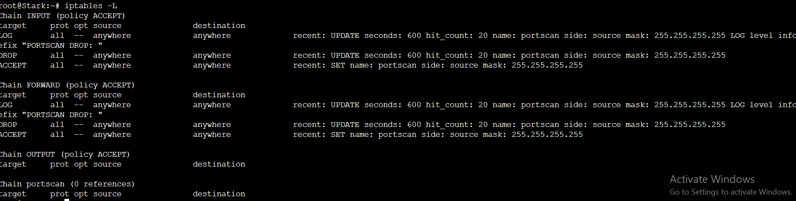

# PRAKTIKUM JARINGAN KOMPUTER MODUL 5

| Kelompok | Nama | NRP |
|----------|------|-----|
| F01      |Alfa Fakhrur Rizal Zaini|5025211214|

## TOPOLOGI


## IP CALCULATION
### SUBNETS

### IP NEEDED

### VLSM TREE


## DNS
**RITCHER**
```sh
echo 'nameserver 192.168.122.1' > /etc/resolv.conf
apt-get update
apt-get install bind9 -y
echo '
options {
    directory "/var/cache/bind";

    forwarders {
          192.168.122.1;
    };

    allow-query{any;};
    auth-nxdomain no;    # conform to RFC1035
    listen-on-v6 { any; };
};
'> /etc/bind/named.conf.options
service bind9 restart
```
## DHCP
**REVOLTE**
```sh
echo 'nameserver 192.168.122.1' > /etc/resolv.conf
apt-get update
apt-get install isc-dhcp-server -y 

rm /var/run/dhcpd.pid

service isc-dhcp-server stop
echo 'INTERFACESv4="eth0"' > /etc/default/isc-dhcp-server

echo '
#A1
subnet 10.52.15.104 netmask 255.255.255.252 {}

#A4
subnet 10.52.15.108 netmask 255.255.255.252 {}

#A5
subnet 10.52.15.112 netmask 255.255.255.252 {}

#A6
subnet 10.52.15.116 netmask 255.255.255.252 {}

#A9
subnet 10.52.15.120 netmask 255.255.255.252 {}

#A10
subnet 10.52.15.124 netmask 255.255.255.252 {}

#A3
subnet 10.52.8.0 netmask 255.255.252.0 {
    range 10.52.8.2 10.52.10.226;
    option routers 10.52.8.1;
    option broadcast-address 10.52.11.255;
    option domain-name-servers 10.52.15.122;
    default-lease-time 180;   
    max-lease-time 5760;        
}

#A2
subnet 10.52.0.0 netmask 255.255.248.0 {
    range 10.52.0.2 10.52.4.8;
    option routers 10.52.0.1;
    option broadcast-address 10.52.7.255;
    option domain-name-servers  10.52.15.122;
    default-lease-time 180;   
    max-lease-time 5760;        
}

#A7
subnet 10.52.12.0 netmask 255.255.254.0 {
    range 10.52.12.2 10.52.13.2;
    option routers 10.52.12.1;
    option broadcast-address 10.52.13.255;
    option domain-name-servers  10.52.15.122;
    default-lease-time 180;   
    max-lease-time 5760;        
}

#A8
subnet 10.52.15.128 netmask 255.255.255.128 {
    range 10.52.15.131 10.52.15.195;
    option routers 10.52.15.129;
    option broadcast-address 10.52.15.255;
    option domain-name-servers  10.52.15.122;
    default-lease-time 180;   
    max-lease-time 5760;        
}
' > /etc/dhcp/dhcpd.conf
```

## DHCP RELAY
**ROUTERS**
```sh
echo 'nameserver 192.168.122.1' > /etc/resolv.conf
apt-get update
apt-get install isc-dhcp-relay -y
service isc-dhcp-relay 
echo '
SERVERS="10.52.1.2"  
INTERFACES="eth0 eth1 eth2 eth3 eth4"
OPTIONS=
' > /etc/default/isc-dhcp-relay

echo '
net.ipv4.ip_forward=1
' > /etc/sysctl.conf
service isc-dhcp-relay start
```
## NO 1
```txt
Agar topologi yang kalian buat dapat mengakses keluar, kalian diminta untuk mengkonfigurasi Aura menggunakan iptables, tetapi tidak ingin menggunakan MASQUERADE
```

Pada Aura kita atur rules iptables dengan aturan berikut:
```sh
ETH0_IP=$(ip -4 addr show eth0 | grep -oP '(?<=inet\s)\d+(\.\d+){3}')

iptables -t nat -A POSTROUTING -o eth0 -j SNAT --to-source $ETH0_IP
```
Jangan lupa set nameserver pada node ke arah 192.168.122.1

## NO 2
```txt
Kalian diminta untuk melakukan drop semua TCP dan UDP kecuali port 8080 pada TCP
```

Pada kasus ini, kita implementasikan rules iptables pada node Grobe Forest. Berikut rules iptables yang diimplementasikan untuk menutup semua jalur dan membuka pada protocol tcp port 8080:

```sh
iptables -F
iptables -P INPUT DROP
iptables -P FORWARD DROP
iptables -P OUTPUT DROP

iptables -A INPUT -p tcp --dport 8080 -j ACCEPT
iptables -A OUTPUT -p tcp --dport 8080 -j ACCEPT

iptables -A INPUT -m conntrack --ctstate ESTABLISHED,RELATED -j ACCEPT
iptables -A OUTPUT -m conntrack --ctstate ESTABLISHED,RELATED -j ACCEPT
```

berikut adalah contoh apabila mengakses port 8080 dan non 8080 menggunakan nmap dari TurkRegion ke Grobe Forest


## NO 3
```txt
Kepala Suku North Area meminta kalian untuk membatasi DHCP dan DNS Server hanya dapat dilakukan ping oleh maksimal 3 device secara bersamaan, selebihnya akan di drop
```

Selanjutnya kita perlu menambahkan rules pada DHCP server ``(REVOLTE)`` dan DNS server ``(RITCHER)`` dengan rules yang membatasi jumlah ping sebanyak 3 device secara simultan
```sh
iptables -F
iptables -A INPUT -p icmp --icmp-type echo-request -m connlimit --connlimit-above 3 -j DROP
iptables -A INPUT -m STATE --state ESTABLISHED,RELATED -j ACCEPT
iptables -L
```

## NO 4
```txt
Lakukan pembatasan sehingga koneksi SSH pada Web Server hanya dapat dilakukan oleh masyarakat yang berada pada GrobeFores
```
Berikut merupakan rules yang menyebabkan semua packet dari port 22 didrop dan hanya memperbolehkan packet dari port 22 yang dikirimkan oleh ip milik GrobeForest:
```sh
iptables -F
iptables -A INPUT -p tcp --dport 22 -j DROP
iptables -A INPUT -p tcp --dport 22 -s 10.52.8.3 -j ACCEPT
iptables -A INPUT -m state --state ESTABLISHED,RELATED -j ACCEPT
iptables -L -n
```

## NO 5
```txt
Selain itu, akses menuju WebServer hanya diperbolehkan saat jam kerja yaitu Senin-Jumat pada pukul 08.00-16.00
```
Sebagai aturan tambahan kita buka port 22 hanya pada ja 08.00-16.00
```sh
iptables -A INPUT --dport 22 -s 10.52.8.3 -m time --timestart 08:00 --timestop 16:00 --weekdays Mon,Tue,Wed,Thu,Fri -j ACCEPT
iptables -L -n -v
```

## NO 6
```txt
Lalu, karena ternyata terdapat beberapa waktu di mana network administrator dari WebServer tidak bisa stand by, sehingga perlu ditambahkan rule bahwa akses pada hari Senin - Kamis pada jam 12.00 - 13.00 dilarang (istirahat maksi cuy) dan akses di hari Jumat pada jam 11.00 - 13.00 juga dilarang (maklum, Jumatan rek)
```
Berikut merupakan aturan tambahannya
```sh
iptables -A INPUT --dport 22 -s 10.52.8.3 -m time --timestart 12:00 --timestop 13:00 --weekdays Mon,Tue,Wed,Thu -j DROP
iptables -A INPUT --dport 22 -s 10.52.8.3 -m time --timestart 11:00 --timestop 13:00 --weekdays Fri -j DROP
iptables -A INPUT --dport 22 -s 10.52.8.3 -m time --timestart 08:00 --timestop 16:00 --weekdays Mon,Tue,Wed,Thu,Fri -j ACCEPT
iptables -L -n -v
```

## NO 7
```txt
Karena terdapat 2 WebServer, kalian diminta agar setiap client yang mengakses Sein dengan Port 80 akan didistribusikan secara bergantian pada Sein dan Stark secara berurutan dan request dari client yang mengakses Stark dengan port 443 akan didistribusikan secara bergantian pada Sein dan Stark secara berurutan
```
Berikut kita tambahkan aturan pada route ``Heiter`` dan ``Frieren``
```sh
STARK="10.52.15.114"
SEIN="10.52.8.2"
iptables -t nat -F
iptables -A PREROUTING -t nat -p tcp --dport 80  -d 10.52.8.2 -m nth --every 2 --packet 0 -j DNAT --to-destination 10.52.8.2:80
iptables -A PREROUTING -t nat -p tcp --dport 80 -d 10.52.8.2 -j DNAT --to-destination 10.52.15.114:80

iptables -A PREROUTING -t nat -p tcp --dport 443  -d 10.52.15.114 -m nth --every 2 --packet 0 -j DNAT --to-destination 10.52.8.2:443
iptables -A PREROUTING -t nat -p tcp --dport 443 -d 10.52.15.114 -j DNAT --to-destination 10.52.15.114:443
```

Pada masing masing stark dan sein, kit aatur agar pada port 80 dan 443 akan mengeluarkan pesan spesifik seperti:

``echo 'Hello froom $HOST'``

Contoh hasilnya:


## NO 8
```txt
Karena berbeda koalisi politik, maka subnet dengan masyarakat yang berada pada Revolte dilarang keras mengakses WebServer hingga masa pencoblosan pemilu kepala suku 2024 berakhir. Masa pemilu (hingga pemungutan dan penghitungan suara selesai) kepala suku bersamaan dengan masa pemilu Presiden dan Wakil Presiden Indonesia 2024
```
Berikut merupakan rules yang perlu ditambah pada webserver, dengan menambahkan rules ini, maka subnet revolte akan dilarang mengakses webserver selama jangka waktu yang berlaku
```sh
SUB_REVOLTE="10.52.15.124/30"
PEMILU_S=$(date -d "2023-10-19T00:00" +"%Y-%m-%dT%H:%M")
PEMILU_E=$(date -d "2024-02-15T00:00" +"%Y-%m-%dT%H:%M")
iptables -A INPUT -p tcp -s $SUB_REVOLTE --dport 80 -m time --datestart "$PEMILU_S" --datestop "$PEMILU_E" -j DROP
```

## NO 9 & 10
```txt
Sadar akan adanya potensial saling serang antar kubu politik, maka WebServer harus dapat secara otomatis memblokir  alamat IP yang melakukan scanning port dalam jumlah banyak (maksimal 20 scan port) di dalam selang waktu 10 menit. 
(clue: test dengan nmap)
Karena kepala suku ingin tau paket apa saja yang di-drop, maka di setiap node server dan router ditambahkan logging paket yang di-drop dengan standard syslog level
```
Berikut merupakan setup yang digunakan pada webserver
```sh
iptables -N portscan

iptables -A INPUT -m recent --name portscan --update --seconds 600 --hitcount 20 -j LOG --log-prefix "PORTSCAN DROP: " --log-level 6
iptables -A INPUT -m recent --name portscan --update --seconds 600 --hitcount 20 -j DROP

iptables -A FORWARD -m recent --name portscan --update --seconds 600 --hitcount 20 -j LOG --log-prefix "PORTSCAN DROP: " --log-level 6
iptables -A FORWARD -m recent --name portscan --update --seconds 600 --hitcount 20 -j DROP

iptables -A INPUT -m recent --name portscan --set -j ACCEPT
iptables -A FORWARD -m recent --name portscan --set -j ACCEPT
```

Result iptables:



Result:

